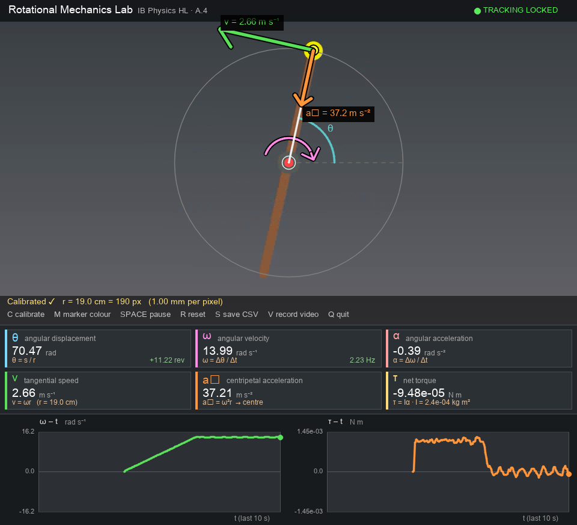
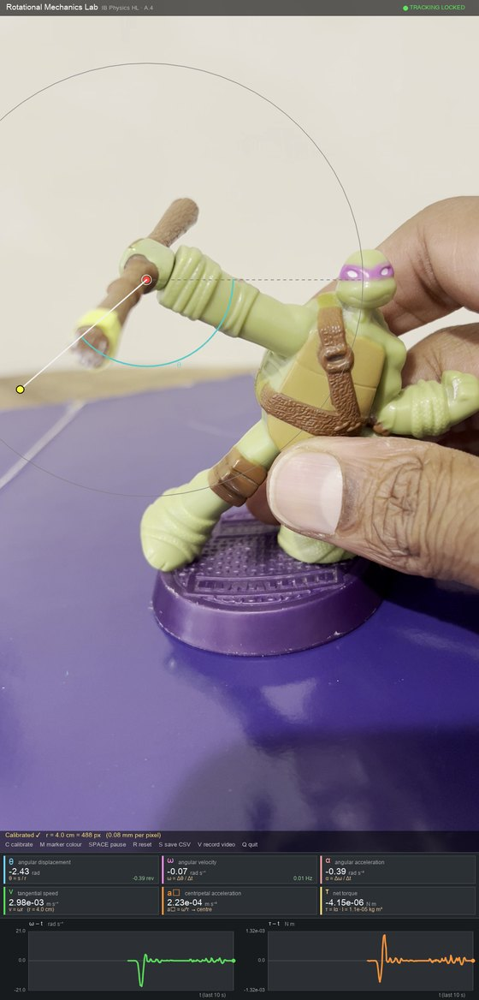

# Rotational Mechanics Lab — IB Physics HL


> [!NOTE]
> This is **v2** — a full rewrite of the original tracker (still available on the [`v1` branch](https://github.com/AYDXB09/Ninja_Spin_Speed/tree/v1)). It was built for a physics investigation into the spin of a toy figure's staff. It runs **entirely on your own machine**: no network calls, nothing is uploaded.

A tracker for a spinning staff. Stick bright tape on one tip, point a camera (or load a video), and it overlays **θ, ω, α, v = ωr, a_c = ω²r, τ = Iα** and rolling ω–t / τ–t graphs on the picture, with proper physics vector arrows (tangential **v**, inward **a_c**, a curved spin-direction arrow, and the θ arc from the reference axis). Press **S** and every sample is saved to a CSV for your own graphs.

### Contents
[Screenshots](#screenshots) · [How it works](#how-it-works) · [What it measures](#what-it-measures) · [Does it measure correctly?](#does-it-measure-correctly) · [Running it](#running-it) · [Keys](#keys) · [Tips](#tips-for-clean-data) · [Honest limits](#honest-limits) · [Privacy](#privacy) · [License](#license)

## Screenshots

**Simulated clip with a known answer — not real footage.** A yellow-tipped staff spinning at exactly 14 rad/s (after a 3 s ramp-up), rendered by [`tools/verify_on_simulated_clip.py`](tools/verify_on_simulated_clip.py) and analysed by the app's real main loop. The tracker is locked, the ω–t graph shows the ramp then the plateau, and the readouts (ω = 13.99 rad/s, v = 2.66 m/s, a_c = 37.2 m/s²) match the ground truth.



**Real footage, hand-held.** The app locked onto the yellow tape of a real toy staff and drew the overlay. This is *not* a valid measurement: the camera and the hand both move, so the axle is not fixed (see [Honest limits](#honest-limits)). It is here to show what real footage looks like to the tracker, not what a good experiment looks like.



## How it works

1. **Mark the tip** — put bright tape on one end of the staff. Press **M** and click the tape: this locks the exact colour (strongly recommended — it stops the tracker confusing the toy's own body for the marker).
2. **Calibrate** — press **C**, click the **centre of rotation** (the axle), then the tape tip. The distance between the two clicks is the staff's radius, which converts pixels to centimetres.
3. **Spin.** Everything updates live.

Three layers keep the marker from being lost or stolen at speed:

| Layer | What it does | Where |
|---|---|---|
| **Annulus constraint** | After calibration the tip can only be on the spin circle, so the search is restricted to a thin ring around it. Background objects and the toy's body are never considered. | `ColorTracker.find` |
| **Physics prediction** | Extrapolates where the tip *should* be from the current ω and looks there first, so a marker that moves 150 px per frame is still followed instead of rejected as a jump. | `PhysicsEngine.predict_angle` |
| **Motion-blur rescue** | Fast spins smear the tape and wash out its colour. A relaxed colour range is allowed, but only inside the frame-difference motion mask, so it can't latch onto anything static. | `ColorTracker.find` |

The badge at the top right shows the state: **TRACKING LOCKED** (green) / **SEARCHING…** / **CALIBRATE**.

## What it measures

| Quantity | Formula | Notes |
|---|---|---|
| θ | angle of the tip about the axle, **unwrapped** | counter-clockwise positive; accumulates over many turns |
| ω, α | 1st and 2nd derivative of θ | Savitzky–Golay: 9-sample window, quadratic fit |
| v | ω · r | r = L/2 for a centre pivot, L for an end pivot (`--pivot end`) |
| a_c | ω² · r | centripetal acceleration |
| I | m L² / 12 (centre) · m L² / 3 (end) | uniform rod |
| τ | I · α | net torque |

You enter the staff **length in cm** (default 8) and **mass in grams** (default 20). Exported CSV columns: `t (s), theta (rad), omega (rad/s), alpha (rad/s^2), v (m/s), a_c (m/s^2), tau (N m)`.

## Does it measure correctly?

Two checks are built in, and both run without a camera.

**1. `--selftest` — the physics engine.** Eight checks feed synthetic spins of known ω and α through the same pipeline: constant spin, constant α, clockwise sign, pixel noise, colour detection, background-distractor rejection, 150 px/frame fast tracking, and motion-blur rescue. It **passes 8/8, with and without SciPy** (without it, a plain finite-difference fallback is used and the noise check's scatter doubles from 0.23 to 0.48 rad/s).

**2. `tools/verify_on_simulated_clip.py` — the whole app.** It renders a video of a staff spinning with a *known* motion (ω ramps 0 → 14 rad/s in 3 s, then stays at 14), drives the app's real main loop on it with a scripted mouse and keyboard, and compares the exported CSV with the truth:

| Quantity | Measured | True | Error |
|---|---|---|---|
| ω, steady phase | 14.00 rad/s | 14.00 | 0.01 % |
| v = ωr | 2.660 m/s | 2.660 | 0.01 % |
| a_c = ω²r | 37.24 m/s² | 37.24 | 0.01 % |
| α, ramp phase | 4.706 rad/s² | 4.667 | 0.85 % |
| τ = Iα, ramp phase | 1.133 × 10⁻³ N m | 1.123 × 10⁻³ | 0.85 % |
| total angle over 12 s | 147.0 rad | 147.0 | 0.00 % |

This proves the maths and the tracker on a clean clip. It does **not** prove your experiment is good — that depends on your camera setup (see below).

## Running it

<details>
<summary><b>Setup and commands</b> (click to expand)</summary>

```bash
pip install -r requirements.txt
python spin_tracker.py                      # live camera (see the platform note below)
python spin_tracker.py --video clip.mp4     # analyse a recorded video instead
python spin_tracker.py --selftest           # verify the physics, no camera needed
python tools/verify_on_simulated_clip.py    # verify the whole app on a simulated clip
```

On Windows you can double-click **`run_tracker.bat`** instead.

It asks two things only: the staff **length in cm** (default 8) and **mass in grams** (default 20). The pivot is assumed to be the staff's centre; if yours pivots at one end, add `--pivot end`. You can also pass `--length_cm 8 --mass_g 20` to skip the questions, and `--camera 1` to choose another camera.

**Video files:** calibrate on the first frame (**M**, then **C**). Analysis **starts automatically** as soon as you finish calibrating (SPACE pauses it); a CSV is saved at the end of the clip. Press **V** first if you also want the annotated video written out.

</details>

## Keys

| Key | Action |
|---|---|
| C | Calibrate (click axle, then tip) |
| M | Lock marker colour from a click |
| SPACE | Pause / resume |
| R | Reset angle, graphs, data |
| S | Save all recorded data to CSV (`spin_data_<timestamp>.csv`) |
| V | Record an annotated MP4 of the tracked feed |
| Q / ESC | Quit |

## Tips for clean data

- **Fix the camera** (tripod or propped) and **fix the axle** — the tracker assumes the centre of rotation does not move.
- Keep the camera **square-on** to the plane of rotation; a tilted view turns the circle into an ellipse and distorts ω within each revolution.
- Bright, even lighting with a short exposure freezes motion blur.
- Pick a tape colour nothing else in frame shares, and lock it with **M**.
- **If the spin is too fast for your camera:** the marker must move less than half a turn per frame, so max |ω| ≈ π × fps (≈ 94 rad/s ≈ 15 rev/s at 30 fps). Beyond that, film in slow motion and analyse the file; timing then comes from the video's frame rate.

## Honest limits

- **Needs a fixed camera and a fixed axle.** The real-footage screenshot above is hand-held and the toy moves in the hand, so its numbers mean nothing. Only the simulated clip is a validated measurement.
- **Live camera mode was written and used on Windows** (DirectShow). On macOS/Linux it falls back to OpenCV's default camera backend, which I have **not tested** (no camera was opened during testing). Video-file mode and both checks were run on macOS.
- **Live timing uses the wall clock** between processed frames, not the camera's own timestamps. If your computer processes frames slower than the camera delivers them, ω gets timing jitter. Video-file mode uses the file's frame rate and does not have this problem.
- **Slow-motion phone clips:** the app trusts the frame rate stored in the file. If a phone exports a 240 fps clip tagged at its 30 fps playback rate, every ω comes out wrong by that factor — check the file's frame rate first.
- **Readouts lag by one frame.** ω and α are read from the second-to-last point of a 9-sample smoothing window; on the ramp in the simulated clip the best fit to the truth is a one-frame lag.
- **One marker, one plane.** It tracks a single coloured tip rotating in the image plane. Wobble, tumbling or a second marker are out of scope.
- **Fonts:** on macOS the subscript "c" in *a꜀* is missing from the system fonts and draws as a small box. The numbers are unaffected.
- The tracked sample video `Ninja Turtle Staff spin rate.MOV` is the original footage the project started from (brown staff, no tape). It is kept for reference and is not tuned for the tracker.

## Privacy

Runs locally. It makes **no network calls** and has no accounts, analytics or telemetry. Live mode reads your camera only while the window is open; nothing is stored unless you press **S** (CSV) or **V** (annotated video) — or finish analysing a video file, which saves its CSV automatically. Those files are written to the folder you launched it from and are ignored by git.

## License

[MIT](LICENSE) © 2026 Anvith Yalamanchili
